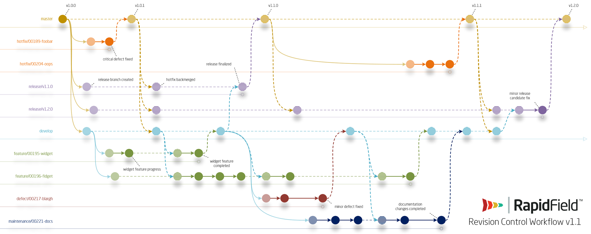

<!--
Copyright (c) RapidField LLC. Licensed under the MIT License. See LICENSE.txt in the project root for license information.
-->

[](README.md)
- - -

# Instructions for Contributing

**Solid Instruments** is [MIT-licensed](https://en.wikipedia.org/wiki/MIT_License). Your contributions must be your own work. Review the [license terms](LICENSE.txt) and the [**Code of Conduct**](CODE_OF_CONDUCT.md) before contributing.

For questions, contact [:email:solidinstruments@rapidfield.com](mailto:solidinstruments@rapidfield.com).

## License

By contributing to **Solid Instruments** you assert and agree that:

1. Your contribution is your own original work.
2. You have the right to assign the copyright for the work (it is not owned by your employer, or you have been granted copyright assignment rights in writing).
3. Your contribution is licensed under [the terms](LICENSE.txt)  applied to the **Solid Instruments** project.

## Repository contents

Contents of the repository are organized as follows.

- [:file_folder:`/cicd`](/cicd) houses source objects which define the behavior of the CI/CD pipeline
- [:file_folder:`/doc`](/doc) contains content and configuration files that serve as the source for the [project website](https://www.solidinstruments.com).
- [:file_folder:`/example`](/example) contains sample projects that utilize the product libraries.
- [:file_folder:`/src`](/src) houses the source for the product libraries.
- [:file_folder:`/test`](/test) houses the test projects for the product libraries.

## Tooling

**Solid Instruments** is developed using [**Visual Studio**](https://visualstudio.microsoft.com/downloads) with the following extensions installed.

- [**CodeMaid**](http://www.codemaid.net) is used to maintain standard document formatting throughout the project.
- [**Visual Studio Spell Checker**](https://ewsoftware.github.io/VSSpellChecker) is used to uncover spelling errors.

CI/CD tooling is managed and defined by [:page_facing_up:`cicd/modules/AutomationTools.psm1`](cicd/modules/AutomationTools.psm1). The build environment setup process -- which is initiated by [:page_facing_up:`cicd/scripts/ResetEnvironment.ps1`](cicd/scripts/ResetEnvironment.ps1) -- installs the following tools.

### :hammer_and_wrench: Command-line tools

- [**The .NET SDK**](https://docs.microsoft.com/en-us/dotnet/core/sdk) is the project's foundational build and test instrument.
- [**codecov.exe**](https://github.com/codecov/codecov-exe) publishes test coverage reports.
- [**DocFx**](https://dotnet.github.io/docfx/tutorial/docfx_getting_started.html) produces the [project website](https://www.solidinstruments.com).
- [**HTMLMinifier**](https://www.npmjs.com/package/html-minifier) minifies the project website.
- [**OpenCover**](https://github.com/OpenCover/opencover) executes the project tests and produces test coverage reports.
- [**powershell-yaml**](https://github.com/cloudbase/powershell-yaml) extracts configuration information during the build process.
- [**psake**](https://github.com/psake/psake) organizes and groups CI/CD operations (see [:page_facing_up:`psakefile.ps1`](psakefile.ps1)).

### :package: Package managers

- [**Chocolatey**](https://chocolatey.org/about)
- [**npm**](https://docs.npmjs.com/about-npm)
- [**NuGet**](https://www.nuget.org)

## Conventions

The **Solid Instruments** team adheres to a variety of design and workflow conventions, which are described here. We value consistency in these practices. Please feel free to contact us with questions using any available avenue.

### :triangular_ruler: Architecture

New contributors should familiarize themselves with basic architectural conventions by reviewing the [**Architectural Guide**](ARCHITECTURE.md). The existing body of source can often be used as a reliable authority when making design decisions but, when in doubt, ask for advice from experienced contributors or contact [:email:solidinstruments@rapidfield.com](mailto:solidinstruments@rapidfield.com).

### :black_nib: Design and style

The [:page_facing_up:`.editorconfig`](.editorconfig) and [:page_facing_up:`CodeMaid.config`](CodeMaid.config) files, in combination, define most of the project's styling guidelines. More information can be found by reading the [**Development Guidelines**](GUIDELINES.md). When in doubt, look to examples within the source for styling guidance, or contact [:email:solidinstruments@rapidfield.com](mailto:solidinstruments@rapidfield.com) with questions.

### :arrows_clockwise: Revision control workflow

The **Solid Instruments** team uses **RapidField Revision Control Workflow 1.1**, a [**GitFlow**](https://nvie.com/posts/a-successful-git-branching-model/)-like strategy for managing source branches.

The following patterns define the project's branch naming and usage conventions. Five-digit numeric tokens ("00000") represent an associated issue number.

#### :yellow_circle: Master branch

:yellow_circle:`master` is the root branch and represents, at all times, the state of the latest production release. The team aims to maintain a 99.9% minimum build success rate for :yellow_circle:`master`.

#### :orange_circle: Hotfix branches

Branches matching the pattern :orange_circle:`hotfix/00000-{semantic-key}` are children of :yellow_circle:`master` and house active work associated with an urgent production defect. Pull requests to hotfix branches may be used to share unfinished work with other team members working on associated issues, but those pull requests should pass all status checks.

#### :purple_circle: Release branches

Branches matching the pattern :purple_circle:`release/v0.0.0` are children of :yellow_circle:`master` and house completed, tested and integrated work for a named release. Release branches should always be in a releasable state.

#### :large_blue_circle: Develop branch

:large_blue_circle:`develop` is a child of :yellow_circle:`master` and serves as an integration branch for completed and tested work sourced from defect, feature and maintenance branches. The team aims to maintain a 99.9% minimum build success rate for :large_blue_circle:`develop`.

#### :red_circle: Defect branches

Branches matching the pattern :red_circle:`defect/00000-{semantic-key}` are children of :large_blue_circle:`develop` and house active work associated with a non-urgent defect. Pull requests to defect branches may be used to share unfinished work with other team members working on associated issues, but those pull requests should pass all status checks.

#### :green_circle: Feature branches

Branches matching the pattern :green_circle:`feature/00000-{semantic-key}` are children of :large_blue_circle:`develop` and house active feature development work. Pull requests to feature branches may be used to share unfinished work with other team members working on associated issues, but those pull requests should pass all status checks.

#### :black_circle: Maintenance branches

Branches matching the pattern :black_circle:`maintenance/00000-{semantic-key}` are children of :large_blue_circle:`develop` and house active project maintenance work. Pull requests to maintenance branches may be used to share unfinished work with other team members working on associated issues, but those pull requests should pass all status checks.

#### :brown_circle: User branches

Branches matching the pattern :brown_circle:`user/{username}/00000-{semantic-key}` serve as source branches for pull requests targeting defect, feature and maintenance branches. User branches may contain work-in-progress and there are no requirements for them with respect to status checks.

#### :twisted_rightwards_arrows: Workflow diagram

**RapidField Revision Control Workflow 1.1** diverges from  [**GitFlow**](https://nvie.com/posts/a-successful-git-branching-model/) by introducing defect and maintenance branches, which are treated like feature branches from a process perspective but are used for different purposes. The workflow is diagrammed below.

[](RapidFieldRevisionControlWorkflow.png)

### :label: Release versioning

**Solid Instruments** releases are versioned using the [**Semantic Versioning 2.0.0**](https://semver.org/spec/v2.0.0.html) specification. Release versioning is controlled via the [:page_facing_up:`appveyor.yml`](appveyor.yml) file. Please do not submit pull requests that modify the build version. The maintainers manage release versioning.

## Get started

Ready to start contributing? You know what to do.

```shell
git clone https://github.com/RapidField/solid-instruments.git
```

### 💻 Environment setup

After cloning the repository, navigate to the root directory in an administrative [**PowerShell**](https://github.com/PowerShell/PowerShell#get-powershell) session and execute [:page_facing_up:`Build.ps1`](Build.ps1) to install the command-line tools and verify the status of your build.

###### PowerShell

```powershell
.\build.ps1 -interactive
```

### :heavy_check_mark: Build verification

During development it is good practice to ensure that your build remains in a passing state. Before pushing commits upstream, open a [**PowerShell**](https://github.com/PowerShell/PowerShell#get-powershell) console and execute the `verify` task in the project root.

###### PowerShell

```powershell
psake verify
```

### :star2: Your first issue

First-time contributors are welcome to start with any open, unassigned issues labeled [:label:**Tag-GoodFirstIssue**](https://github.com/RapidField/solid-instruments/issues?q=is%3Aopen+is%3Aissue+label%3AStage-2-Accepted+no%3Aassignee). After picking one, leave a comment on the issue so that we can assign it to you and promote its status.

Revision control plans are provided with the descriptions of all accepted issues. Please review carefully before starting.

## Get help

If you encounter problems or if questions arise, there are several options available for finding help.

- Check out the [**API Reference**](https://www.solidinstruments.com/api).
- Ask the community for [help via **Gitter**](https://gitter.im/RapidField/solid-instruments).
- Open a [new issue](https://github.com/RapidField/solid-instruments/issues/new/choose).
- Email the core team at [:email:solidinstruments@rapidfield.com](mailto:solidinstruments@rapidfield.com).

<br />

- - -

<br />

[](https://www.rapidfield.com)

###### Copyright (c) RapidField LLC. All rights reserved. "RapidField" and "Solid Instruments" are trademarks of RapidField LLC.
